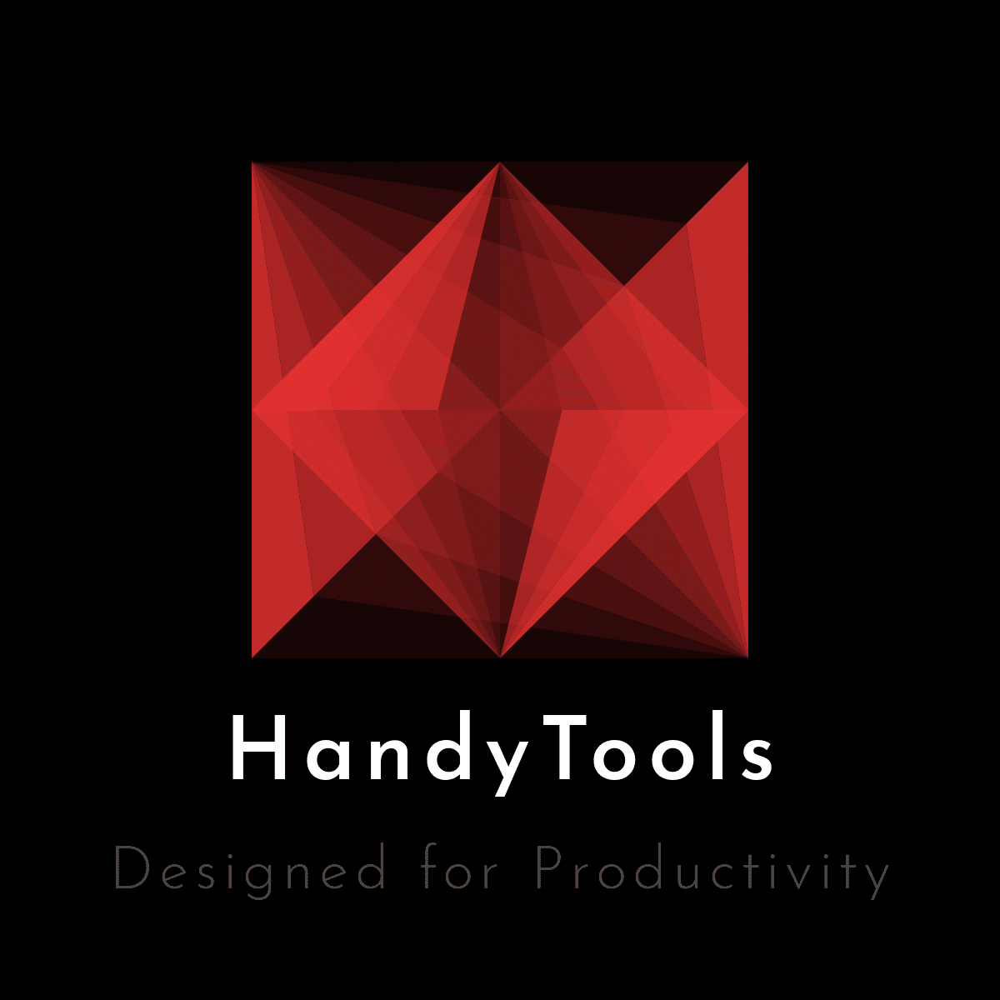

# **HandyTools**
### Great Handy code snippets for all languages that makes you more productive in your Coding

## About Project:
This Project is developed in order to help the developers who know basics, in there project for rapid development without any time waste in the little things that bother developers the most.

## Navigation for Languages

**[PHP](https://github.com/neo-0224/HandyTools/tree/master/src/languages/php/)**

## Navigation for Frameworks

**[Django](https://github.com/neo-0224/HandyTools/tree/master/src/frameworks/django/)**

## Note: 
##### This Project is not recommended to use as learning purpose because, It is specially designed for developers who have little experience in the stack.

## How to contribute:
If you have any code snippet that can save a lot of time for the project development and want to share it with world with the glory of Software development Ethcs, then all the contributions are heartly welcomed.

All you need to do is clone this repo, choose your stack and make a folder of your snippet. Inside that folder keep your files separate and keep minimum code that is related to the snippet or the particular task only. Also include requirements file or dependency file in order to reduce the possible errors. Must include a GUIDE.txt and inside that file, you should keep your name and about you in atmost 50 words. Then you should mention every single detail related to the snippet that can confuse the devlopers.

[click here](https://github.com/neo-0224/HandyTools/) to Contribute to Project Now

Thank you.

##### Live version of all the snippets coming soon.

## About Me:

I am an Engineering Undergraduate student from India. Basically I have been fascinated by the power of Open source communities since I have started my Developer career two years ago. My major stack of Development includes Python, JavaScript, HTML5, CSS3 and Frameworks like Bootstrap4, Django, Django REST Framework. I am currently improving my skills on Machine Learning using Tensorflow. Besides this, I am also a great fan of Blockchain Technology. 

Want to ping me?

[Facebook](https://www.facebook.com/profile.php?id=100009926198901)
[Instagram](https://www.instagram.com/m0nuu.tyagi_g)
[LinkedIn](https://www.linkedin.com/in/iammanojtyagi/)
