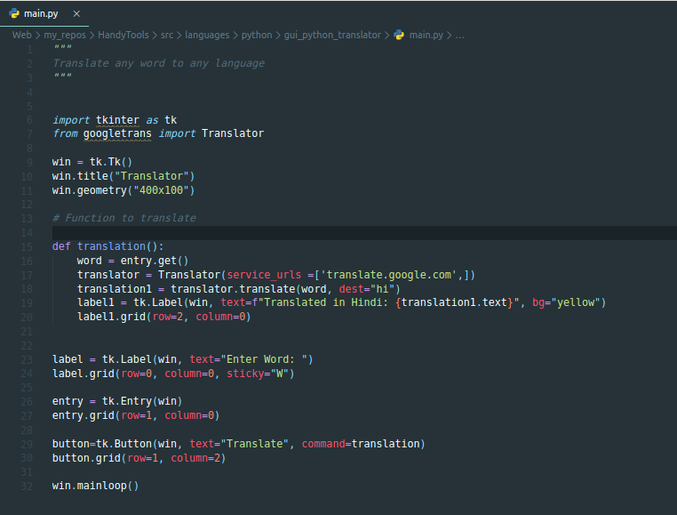
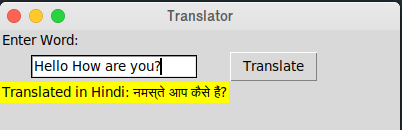

# HandyTools - GUI Translator Python

**Hello This is a simple GUI Translator developed in Python which can translate English to any language by Just changing a single line in the code.**

*To know more about the code... *

*To explore the entire repository... *